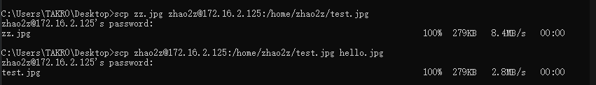

# How to Use SCP Command to Securely Transfer Files


*Updated May 30, 2020*

**总结：** 很基础很简单的工具，记住下面的使用命令即可，再加上几个-p -r的选项。

**SCP (secure copy) is a command-line utility that allows you to securely copy files and directories between two locations.**

The `scp` command syntax take the following form:

```scp
scp [OPTION] [user@]SRC_HOST:]file1 [user@]DEST_HOST:]file2
```

- `OPTION` - [scp options](https://linux.die.net/man/1/scp) such as cipher, ssh configuration, ssh port, limit, recursive copy …etc.
- `[user@]SRC_HOST:]file1` - Source file.
- `[user@]DEST_HOST:]file2` - Destination file

[scp(1): secure copy - Linux man page (die.net)](https://linux.die.net/man/1/scp)


`scp` provides a number of options that control every aspect of its behavior. The most widely used options are:

- `-P` - Specifies the remote host ssh port.
- `-p` - Preserves files modification and access times.
- `-q` - Use this option if you want to suppress the progress meter and non-error messages.
- `-C` - This option forces `scp` to compresses the data as it is sent to the destination machine.
- `-r` - This option tells `scp` to copy directories recursively.


**The `scp` command relies on `ssh` for data transfer, so it requires an ssh key or password to authenticate on the remote systems.**




SSH登录

[How to Setup Passwordless SSH Login | Linuxize](https://linuxize.com/post/how-to-setup-passwordless-ssh-login/)

.ssh 文件

```sh
Host targaryen
    HostName 192.168.1.10
    User daenerys
    Port 7654
    IdentityFile ~/.ssh/targaryen.key

Host tyrell
    HostName 192.168.10.20

Host martell
    HostName 192.168.10.50
```

